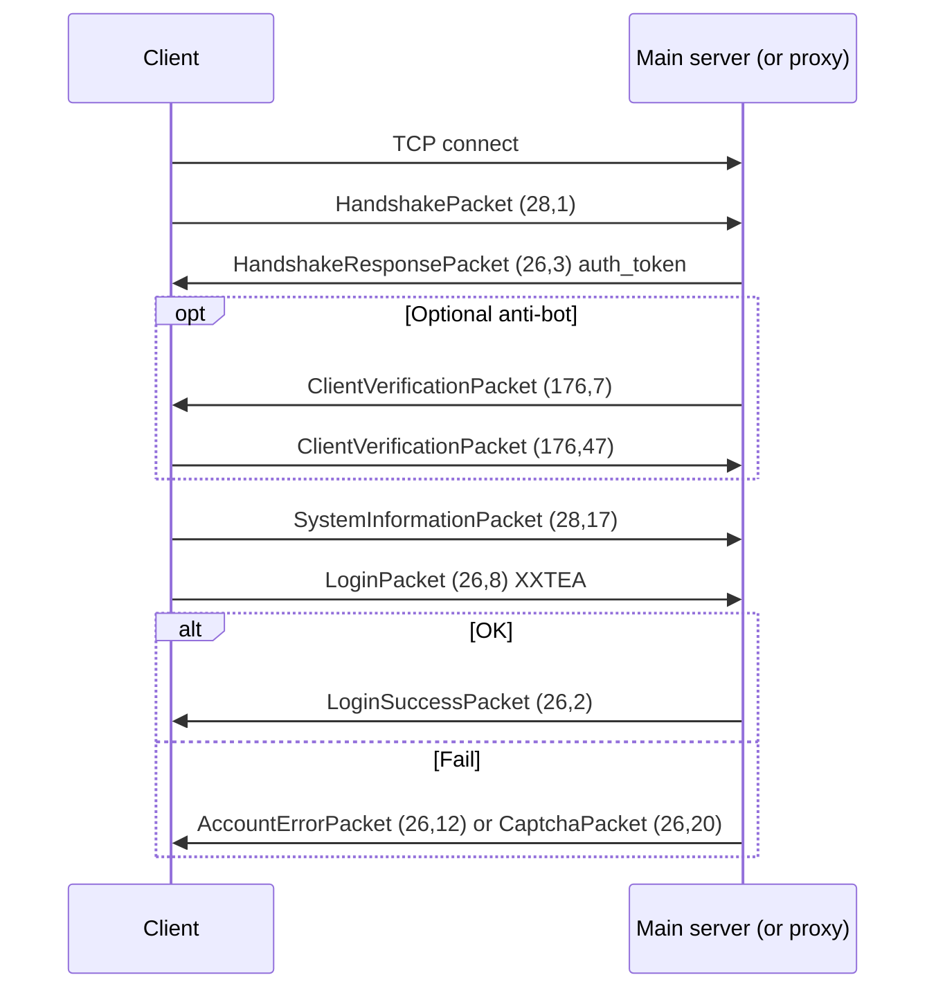

# Transformice login: packets, wire format, and client behavior

This document explains how **packets** participate in the **login phase** of Transformice’s MAIN TCP connection. It is written for this repository’s **caseus**-based proxy (`bot/ban_proxy.py`).

## Scope and sources

| Source | What it gives |
|--------|----------------|
| **`Transformice.swf`** | The proprietary game client. **This repo does not include `Transformice.swf`**, so we do not decompile bytecode here. |
| **`caseus`** (Python, vendored in `venv`) | Reverse-engineered **packet IDs, field layout, ciphers, and sequencing** derived from the game’s behavior. Many field comments explicitly map to **Flash / AIR APIs** (e.g. `Capabilities.os`, loader byte length). |
| **`bot/ban_proxy.py`** | Injects **`LoginPacket`** after **`SystemInformationPacket`** and rewrites **`ChangeSatelliteServerPacket`** for local proxies. |

**Bottom line:** The **authoritative structural description** of “how Packet works” for login is **`caseus.packets`** + **`caseus.proxies.Proxy`**, not a SWF disassembly in this tree. If you add `Transformice.swf` locally, you can cross-check string literals and class names; the wire format below should still match.

---

## 1. Framing: bytes on the wire

Before any “login” logic runs, the TCP stream is segmented into **messages**:

1. **`PacketLength`** — a **signed 32-bit VarInt** (same family as Minecraft’s VarInt: 1–5 bytes, see `caseus.types.numeric.PacketLength`).
2. **Payload** — exactly `PacketLength` bytes for one logical packet.

So: `read VarInt N` → `read N bytes` → parse packet.

---

## 2. Packet envelope: `(C, CC)` and fingerprint

Inside the payload, **caseus** models Transformice’s header as:

### Clientbound (server → client)

- **`PacketCode`**: two unsigned bytes `(C, CC)` — the packet **type**.
- No per-packet fingerprint in the header (see `caseus.packets.packet.ClientboundPacket`).

### Serverbound (client → server)

- **`fingerprint`**: one byte (`0…99`), incremented by the sender after each serverbound packet (`caseus.proxies.proxy.Proxy.ServerConnection._written_packet_data`).
- **`PacketCode`**: `(C, CC)` as two bytes.
- **Body** may be **ciphered** depending on packet class (see §5).

The tuple **`(C, CC)`** is what older docs and game jargon sometimes call **CCC** (two components written as separate bytes).

---

## 3. Login-related packet IDs (MAIN connection)

These are the types that matter for “logging in” on the **main** socket. IDs are from `caseus.packets.serverbound.main` and `caseus.packets.clientbound.main`.

### Serverbound (client → server)

| Packet | ID `(C, CC)` | Notes |
|--------|----------------|--------|
| `HandshakePacket` | `(28, 1)` | First real game packet after TCP connect; advertises version, loader size, environment. |
| `SystemInformationPacket` | `(28, 17)` | Sent **after** `HandshakeResponsePacket`; OS / Flash / language surface. |
| `SteamInfoPacket` | `(26, 12)` | Optional; Steam login path. |
| `LoginPacket` | `(26, 8)` | Username, password hash, `loader_url`, auth token XOR, etc. |
| `CaptchaRequestPacket` | `(26, 20)` | Client asks for captcha (rare path). |
| `ClientVerificationPacket` | `(176, 47)` | Reply to anti-bot challenge (`ciphered_data`). |

### Clientbound (server → client)

| Packet | ID `(C, CC)` | Notes |
|--------|----------------|--------|
| `HandshakeResponsePacket` | `(26, 3)` | **`auth_token`** for XOR with `secrets.auth_key` in `LoginPacket`. |
| `LoginSuccessPacket` | `(26, 2)` | Session established; includes `session_id`, `username`, community, staff roles. |
| `AccountErrorPacket` | `(26, 12)` | Login failure (`error_code`, hints). |
| `CaptchaPacket` | `(26, 20)` | Image / challenge data. |
| `ClientVerificationPacket` | `(176, 7)` | Optional gate before login (see §7). |
| `ChangeSatelliteServerPacket` | `(44, 1)` | After login flow progresses — tells client where **satellite** TCP lives (not the same as MAIN login, but part of “getting into the game”). |
| `ChangeMainServerPacket` | `(28, 98)` | Redirect main server (proxy raises `NotImplementedError` — must not occur for this bot). |

---

## 4. Field-level: the login handshake

### 4.1 `HandshakePacket` `(28, 1)`

Defined in `caseus.packets.serverbound.main`. Comments in **caseus** tie fields to **Flash / AIR**:

| Field | Role |
|-------|------|
| `game_version` | Short; must match what the server expects (secrets / server build). |
| `language` | From client language selection; Norwegian `nb` → `no` special case in `caseus.clients.client.Client.handshake`. |
| `connection_token` | From **`Secrets`** — anti-leak token bundled with the client distribution. |
| `player_type` | e.g. AIR executable string vs browser. |
| `browser_info` | From JS `navigator` in browser; **standalone** often `"-"`. |
| `loader_stage_size` | **Byte length of the loaded loader SWF.** Server can **drop the connection** if this does not match expectations (`caseus.servers.server.MinimalServer` closes if wrong). Proxies often rewrite this to a known good constant (`caseus.proxies.proxy.Proxy.CORRECTED_LOADER_SIZE = 0x1FBD`) because tfm-proxy loaders differ from vanilla. |
| `ccf_data` | SharedObject-related; often empty. |
| `concatenated_font_name_hash` | Hash string of font list. |
| `server_string` | `Capabilities.serverString` (long capability string). |
| `referrer` | Enum or legacy referral global id. |
| `milliseconds_since_start` | Time since client start to first handshake. |
| `game_name` | Documented as always empty in vanilla. |

**Implication for SWF analysis:** In ActionScript, the loader and main SWF read **stage loader bytes**, **Capabilities**, and **timing** — they populate this packet. Your **`LoginPacket.loader_url`** should be consistent with how the real loader would present itself (this repo builds a `file:///…TFMProxyLoader.swf?…` URL for that).

### 4.2 `HandshakeResponsePacket` `(26, 3)`

| Field | Role |
|-------|------|
| `auth_token` | **Integer** used with `secrets.auth_key` to form `ciphered_auth_token` in `LoginPacket`. |
| `num_online_players`, `language`, `country` | Session / locale hints. |

### 4.3 `SystemInformationPacket` `(28, 17)`

| Field | Role |
|-------|------|
| `language` | `Capabilities.language`. |
| `os` | `Capabilities.os`. |
| `flash_version` | `Capabilities.version` (AIR builds still fill this with a “WIN …” style string in **caseus**’s reference `Client`). |
| `zero_byte` | Always `0` in protocol. |

**caseus**’s `MinimalServer` sets `can_login = True` **after** this packet **when** `client_verification_template is None` — i.e. no `(176, 7)` verification step.

### 4.4 `LoginPacket` `(26, 8)` — core credentials

| Field | Type / cipher | Role |
|-------|----------------|------|
| **Cipher** | `CIPHER = IDENTIFICATION` (**XXTEA** with keys from `Secrets`, per fingerprint) | Body is **XXTEA**-protected (see `caseus.secrets`). |
| `username` | String | Account name. |
| `password_hash` | String | **Not raw password** — game uses **SHAKikoo** (`caseus.util.crypto.shakikoo`): SHA-256 → hex → salt → SHA-256 → Base64 string. |
| `loader_url` | String | Document URL of the loader (e.g. `file:///…` or `app:/…`). Server validates semantics tied to anti-cheat / version. |
| `start_room` | String | Optional room to join after login. |
| `ciphered_auth_token` | Int, `UnlessBotRole` | **`auth_token XOR secrets.auth_key`** when `auth_key` is known (`caseus.clients.client.Client.login`). Omitted for bot-role test clients. |
| `unk_short_6` | Short | **Hardcoded `18`** in game and **caseus** client. |
| `login_method` | `LoginMethod` enum | **caseus** only defines `Normal = 0` as used. |
| `unk_string_8` | String | Registration-related leftovers in game code. |

---

## 5. Ciphers and secrets

- **`IDENTIFICATION` (XXTEA)** — Used for **`LoginPacket`** serverbound payload (after header). Keys come from **`Secrets`** derived from game files / `KeySourcesPacket` / `AuthKeyPacket` in extension protocol.
- **`XOR`** — Used for chat-like packets (`CommandPacket`, `RoomMessagePacket`, …), **not** for `LoginPacket`.
- **`Secrets`** (`caseus.secrets.Secrets`) holds `game_version`, `connection_token`, `auth_key`, `packet_key_sources`, `client_verification_template`, etc.

The **proxy** learns `auth_key` when the real client sends **`AuthKeyPacket`** (extension id `"auth_key"`) — `caseus.proxies.proxy.Proxy._load_auth_key` copies secrets onto the server connection.

---

## 6. Optional gate: `ClientVerificationPacket`

Some builds send **clientbound** `ClientVerificationPacket` `(176, 7)` with a **`verification_token`**. The client must answer with **serverbound** `ClientVerificationPacket` `(176, 47)` containing **`ciphered_data`** built from secrets (`client_verification_data`).

**caseus**’s reference `Client` calls **`login()`** only from the **`ClientVerificationPacket`** handler when `username` is set — that models a server that **always** sends verification first.

**caseus**’s **`MinimalServer`** instead allows login **either** after **`SystemInformationPacket`** (no template) **or** after a **good** **`ClientVerificationPacket`** — see `can_login` in `caseus.servers.server`.

**Production Atelier801** behavior can include verification on some paths; **this bot’s proxy** follows the **SystemInformation → inject LoginPacket** path used when verification is not blocking — matching what you see in `bot/ban_proxy.py`.

---

## 7. Success and failure after `LoginPacket`

| Packet | Meaning |
|--------|---------|
| `LoginSuccessPacket` `(26, 2)` | Login OK: `session_id`, `username`, `community`, `registered`, `staff_roles`, etc. |
| `AccountErrorPacket` `(26, 12)` | Rejected login (`error_code`, `suggested_username`, …). |
| `CaptchaPacket` `(26, 20)` | CAPTCHA challenge image / metadata. |

---

## 8. Satellite connection (post-login wiring)

`ChangeSatelliteServerPacket` `(44, 1)` carries `address`, `ports` (string like `"11801-12801-…"`), and identifiers `timestamp`, `global_id`, `auth_id`. The game opens **separate TCP** to the satellite port(s). **`caseus.Proxy`** rewrites address/ports so the client stays on **`127.0.0.1`** and your local satellite port (`BanBotProxy._proxy_satellite_server`). That is **not** part of the username/password exchange, but it is part of “getting fully into the game world” after MAIN login succeeds.

---

## 9. Sequence (conceptual)

The **`caseus.clients.client.Client`** reference implementation sends **SystemInformation** in `_on_handshake_response` and may send **Login** from `_on_client_verification` — ordering differs slightly from **MinimalServer**’s `can_login` gates, but the **packet types and IDs** are the same.

---

## 10. How this repository uses the same packets

- **`bot/ban_proxy.py`** registers listeners on **`HandshakePacket`**, **`SystemInformationPacket`**, **`LoginPacket`**, **`LoginSuccessPacket`**, **`ChangeSatelliteServerPacket`**, etc.
- After **`SystemInformationPacket`** (and optional delay `PACKET_LOGIN_DELAY_SEC`), it sends **`LoginPacket`** with `shakikoo(password)`, `loader_url` from `bot/flash_launch.py`, and `ciphered_auth_token = auth_token XOR auth_key` when available.
- If the real client also sends **`LoginPacket`**, the proxy **drops** the duplicate once it has already injected one (`_gate_duplicate_login_packet`).

---

## 11. References (files to read in `venv/Lib/site-packages/caseus`)

| File | Content |
|------|---------|
| `packets/packet.py` | `PacketCode`, `ServerboundPacket` / `ClientboundPacket`, fingerprint, cipher hooks. |
| `packets/serverbound/main.py` | `HandshakePacket`, `SystemInformationPacket`, `LoginPacket`, field comments. |
| `packets/clientbound/main.py` | `HandshakeResponsePacket`, `LoginSuccessPacket`, `AccountErrorPacket`, `CaptchaPacket`, `ChangeSatelliteServerPacket`. |
| `util/crypto.py` | `shakikoo` password hashing. |
| `secrets.py` | `IDENTIFICATION` / `XOR`, `Secrets` fields. |
| `proxies/proxy.py` | Framing, fingerprint increment, handshake loader size fix, satellite rewrite. |
| `clients/client.py` | Reference defaults (`LOADER_SIZE`, `PLAYER_TYPE`, `LOADER_URL`, handshake/login helpers). |
| `servers/server.py` | `MinimalServer` login gates (`can_login`, `ciphered_auth_token` check). |

---

## 12. If you analyze `Transformice.swf` locally

1. Confirm **strings** for packet class names / identifiers line up with **`(C, CC)`** pairs above (often embedded near serialization code).
2. Trace **loader** → **main** handoff: **`loader_stage_size`** must match what the **main** SWF reports for loaded bytes.
3. Compare **`loader_url`** format with `bot/flash_launch.loader_document_url_for_row` — query parameters become `loaderInfo.parameters` in Flash.
4. Password handling should call into the same **SHAKikoo** pipeline as `caseus.util.crypto.shakikoo` if you replicate login in ActionScript.

This document should be updated if **caseus** bumps packet layouts or IDs after a game update.
